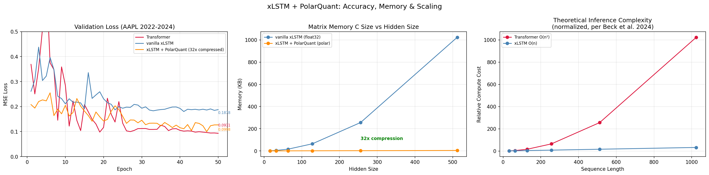

# xLSTM + PolarQuant: Memory-Efficient Financial Time Series Prediction

From-scratch implementation of xLSTM with novel polar coordinate quantization on mLSTM matrix memory, achieving **32x memory compression** with competitive accuracy against transformer baselines on AAPL price prediction.

## Results

| Model | Best Val Loss | Memory | Inference |
|-------|--------------|--------|-----------|
| Transformer | 0.0931 | float32 | O(n²) |
| **xLSTM + PolarQuant** | **0.0998** | **32x compressed** | **O(n)** |
| vanilla xLSTM | 0.1803 | float32 | O(n) |

Polar quantization noise acts as implicit regularization — PolarQuant generalizes better than vanilla xLSTM despite 32x compression, achieving within 7% of transformer accuracy with linear inference scaling.



## Architecture

**xLSTM** (Beck et al. 2024) replaces traditional LSTM's scalar memory with exponential gating (sLSTM) and matrix key-value memory (mLSTM). Each block chains sLSTM → mLSTM with residual connections and layer norm.

**PolarQuant** (novel contribution) compresses the mLSTM matrix memory C via polar coordinate quantization: extract row magnitudes → project onto k=8 orthonormal basis vectors → compute 4 angles via arctan2 → quantize to int8. QJL (Johnson-Lindenstrauss) residual correction recovers approximation error. Straight-through estimator enables stable training — forward pass uses quantized C, backward pass flows through exact C.

Each row: 1 float32 magnitude + 4 int8 angles = 8 bytes instead of 256 bytes = **32x compression**.

## Stack

PyTorch, MLflow, FastAPI, Streamlit, GitHub Actions CI/CD, scipy (drift detection), yfinance

## Quick Start

```bash
git clone https://github.com/binoysaha025/xlstm-polarquant.git
cd xlstm-polarquant/xlstm-polarquant
python -m venv venv && source venv/bin/activate
pip install -r requirements.txt

# train
python train.py

# serve API
uvicorn api.main:app --port 8000

# dashboard (separate terminal)
streamlit run dashboard/app.py

# tests
python test_cells.py
```

## How It Works

User selects a ticker and prediction date. The dashboard pulls 60 prior trading days from yfinance, normalizes using training statistics, runs all three models, and displays predicted vs actual closing price with error metrics. KS-test drift detection flags when incoming data distribution differs from training data (AAPL 2010-2022).

## Limitations

- Simulated quantization during training (float32 with discrete rounding) — true int8 deployment requires CUDA int8 matmul support
- Inference scaling benchmark is theoretical (per Beck et al. 2024) — Python loop prevents empirical latency demonstration
- Single ticker (AAPL) — cross-asset generalization untested

## References

- Beck et al. (2024) — xLSTM: Extended Long Short-Term Memory
- Google DeepMind — TurboQuant / PolarQuant, polar coordinate KV cache quantization
- Johnson & Lindenstrauss (1984) — Random projection distance preservation
